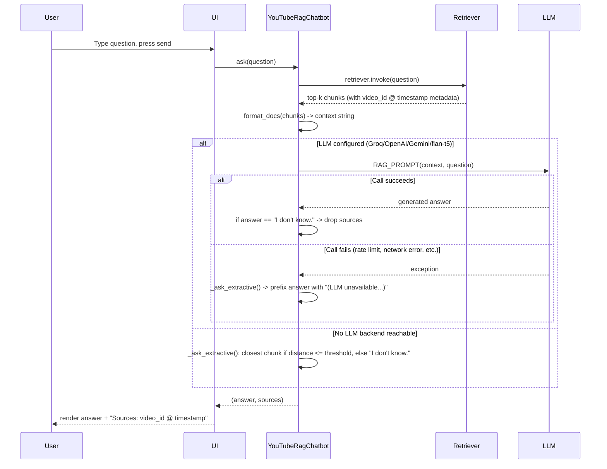

# Architecture — YouTube RAG Chatbot

## 1. Overview

This project is a Retrieval-Augmented Generation (RAG) chatbot that answers questions **only**
from the transcript(s) of YouTube video(s) supplied by the user. It has a Gradio UI and a CLI,
both built on one shared pipeline module, plus a standalone Jupyter notebook that reproduces the
whole pipeline end to end.

Core guarantee: if the answer isn't present in the retrieved transcript context, the bot replies
`I don't know.` instead of guessing.

## 2. High-level architecture

```mermaid
flowchart LR
    subgraph Input
        U[User] -->|YouTube URL/ID| L[Load Video]
        U -->|Question| Q[Ask]
    end

    subgraph Ingestion["Ingestion (per video, at runtime)"]
        L --> YT[YouTube Transcript API]
        YT --> TXT[transcripts/&lt;video_id&gt;.txt<br/>HH:MM:SS tagged captions]
        TXT --> BLK[Group captions into<br/>~800-char timestamped blocks]
        BLK --> SPLIT[RecursiveCharacterTextSplitter<br/>500 chars / 80 overlap]
        SPLIT --> CHUNKS[(In-memory chunk corpus<br/>self.chunks)]
    end

    subgraph Indexing
        CHUNKS --> EMB{Embedding model}
        EMB -->|preferred| HFE[HuggingFace<br/>all-MiniLM-L6-v2]
        EMB -->|offline fallback| TFIDF[scikit-learn<br/>TF-IDF vectorizer]
        HFE --> FAISS[(FAISS vector index<br/>faiss_index/)]
        TFIDF --> FAISS
    end

    subgraph "Retrieval + Generation"
        Q --> RET[Retriever<br/>similarity search, k=4]
        FAISS --> RET
        RET --> CTX[Formatted context<br/>+ video_id @ timestamp]
        CTX --> PROMPT[Context-only prompt template]
        PROMPT --> LLM{LLM}
        LLM -->|preferred| GROQ[Groq]
        LLM -->|or| OPENAI[OpenAI]
        LLM -->|or| GEMINI[Google Gemini]
        LLM -->|local fallback| FLANT5[HuggingFace flan-t5-base]
        LLM -->|no backend available| EXTRACT[Extractive fallback:<br/>closest chunk + distance threshold]
        GROQ --> ANSWER
        OPENAI --> ANSWER
        GEMINI --> ANSWER
        FLANT5 --> ANSWER
        EXTRACT --> ANSWER["Answer + source citations<br/>or: I don't know."]
    end

    ANSWER --> UI[Gradio / CLI]
    UI --> U
```



## 3. Component map

| Layer | Responsibility | Key file(s) |
|---|---|---|
| Transcript ingestion | Resolve video ID, call `youtube-transcript-api`, persist raw captions | [src/rag_pipeline.py](src/rag_pipeline.py) `extract_video_id`, `fetch_transcript`, `fetch_and_save_one` |
| Chunking | Group captions into timestamped blocks, then split with LangChain's `RecursiveCharacterTextSplitter` | `build_chunks` |
| Embeddings | Vectorize chunks/queries; HuggingFace preferred, TF-IDF if the HF Hub is unreachable | `get_embedding_model`, `TfidfEmbeddings` |
| Vector store | FAISS index build/persist/reload | `build_vectorstore`, `load_vectorstore` |
| Retriever | Top-k similarity search over the FAISS index | `YouTubeRagChatbot._rebuild_index` |
| LLM | Provider auto-selection (Groq → OpenAI → Google → local flan-t5 → extractive) | `get_llm` |
| RAG chain | Context-only prompt + citation formatting + `I don't know.` guardrail | `RAG_PROMPT`, `format_docs`, `YouTubeRagChatbot.ask` / `_ask_extractive` |
| Orchestration | Ties ingestion → indexing → retrieval → LLM together; stateful across multiple loaded videos | `YouTubeRagChatbot` class |
| UI - Gradio | Paste-a-link + chat interface | [app.py](app.py) |
| UI - CLI | Terminal chat loop (`exit` to quit) | [cli.py](cli.py) |
| Notebook | Same pipeline, single self-contained executable document | [RAG_YouTube_Chatbot.ipynb](RAG_YouTube_Chatbot.ipynb) |

## 4. Runtime sequence — loading a video

```mermaid
sequenceDiagram
    participant User
    participant UI as Gradio UI
    participant Bot as YouTubeRagChatbot
    participant YT as YouTube Transcript API
    participant FS as transcripts/*.txt
    participant Idx as FAISS index

    User->>UI: Paste YouTube URL, click "Load video"
    UI->>Bot: add_video(url)
    Bot->>Bot: extract_video_id(url)
    Bot->>YT: fetch_transcript(video_id)
    alt Transcript available
        YT-->>Bot: caption segments (text, start, duration)
        Bot->>FS: write transcripts/&lt;video_id&gt;.txt
        Bot->>Bot: build_chunks() -> timestamped blocks -> split chunks
        Bot->>Bot: self.chunks.extend(new_chunks)
        Bot->>Idx: rebuild FAISS.from_documents(self.chunks, embedding_model)
        Idx-->>Bot: vectorstore + retriever
        Bot-->>UI: status message ("Loaded video 'xyz': N chunks indexed")
        UI-->>User: show status + loaded video list; enable chat input
    else Captions disabled / invalid URL / video unavailable
        YT-->>Bot: exception
        Bot-->>UI: "Could not fetch a transcript for that video..."
        UI-->>User: show error status; chat input stays disabled if no video loaded yet
    end
```

## 5. Runtime sequence — asking a question



## 6. Design decisions & resiliency

- **Context-only guardrail**: the prompt explicitly instructs the LLM to answer only from
  supplied context and to reply `I don't know.` verbatim otherwise; `ask()` also strips source
  citations whenever that exact phrase is returned.
- **Graceful LLM-failure fallback**: `ask()` wraps the LLM call in a try/except. If it raises
  (rate limit, quota exhausted, network error, etc.), the question is answered via
  `_ask_extractive()` instead and the response is prefixed with
  `⚠️ (LLM unavailable, showing closest excerpt instead)` rather than the UI hanging or crashing.
  `app.py`'s `bot_respond()` has a second try/except around the whole `bot.ask()` call as a
  last-resort safety net.
- **Chat gated on having a video loaded**: the Gradio question textbox and Send button start
  `interactive=False` (placeholder "Load a YouTube video above to start chatting...") and are
  only enabled once `bot.loaded_video_ids` is non-empty; they're re-disabled by `reset_videos()`
  and re-evaluated by `new_chat()`.
- **Timestamp citations instead of page numbers**: since transcripts don't have pages, each
  chunk's metadata carries the `video_id` and the `HH:MM:SS` timestamp of its first caption line,
  giving a precise "where in the video" citation.
- **Provider-agnostic LLM**: `get_llm()` checks `GROQ_API_KEY` → `OPENAI_API_KEY` →
  `GOOGLE_API_KEY` → local `flan-t5-base` → extractive fallback, so the same code runs with any
  configured provider or with none at all.
- **Offline-safe embeddings**: if `sentence-transformers/all-MiniLM-L6-v2` can't be downloaded
  (e.g. a network blocks huggingface.co), `get_embedding_model()` transparently swaps in a
  scikit-learn TF-IDF vectorizer so indexing still works, just with lower semantic quality.
  Because TF-IDF must be refit on the whole corpus, the FAISS index is rebuilt from the full
  accumulated chunk list (`self.chunks`) on every `add_video()` call in that mode.
  With HuggingFace embeddings, the index is still rebuilt per video for simplicity, at the cost
  of some redundant re-embedding.
- **Multi-video accumulation**: `YouTubeRagChatbot` keeps every loaded video's chunks in memory
  (`self.chunks` / `self.loaded_video_ids`), so users can load several videos and ask questions
  spanning all of them; `reset()` clears the in-memory corpus and index to start over.
- **Shared pipeline module**: `src/rag_pipeline.py` is the single source of truth for
  ingestion/chunking/embedding/retrieval/LLM logic, imported by both `app.py` and `cli.py` so
  behavior stays consistent across the UI and the terminal.

## 7. Tech stack

| Concern | Library |
|---|---|
| Transcript fetch | `youtube-transcript-api` |
| Text splitting | `langchain-text-splitters` (`RecursiveCharacterTextSplitter`) |
| Embeddings | `langchain-huggingface` / `sentence-transformers` (fallback: `scikit-learn` TF-IDF) |
| Vector store | `langchain-community` FAISS wrapper + `faiss-cpu` |
| LLMs | `langchain-groq`, `langchain-openai`, `langchain-google-genai`, or local `transformers` pipeline |
| Orchestration | `langchain-core` (prompts, output parsers, runnables) |
| UI | `gradio` |
| Config | `python-dotenv` (`.env`) |

## 8. Directory layout

```
rag_Assessment_project/
├── RAG_YouTube_Chatbot.ipynb   # single self-contained executable notebook (all 12 steps)
├── src/
│   └── rag_pipeline.py         # shared ingestion/chunking/embedding/retrieval/LLM/chat logic
├── app.py                      # Gradio UI (paste link -> load -> chat)
├── cli.py                      # terminal chat loop (preloads default videos)
├── transcripts/                # generated: one .txt per loaded video, "[HH:MM:SS] caption" lines
├── faiss_index/                # generated: persisted FAISS vector index
├── requirements.txt
├── .env.example                # placeholder API keys (GROQ/OPENAI/GOOGLE/HuggingFace)
└── .gitignore                  # excludes .env, .venv/, faiss_index/, __pycache__/
```
